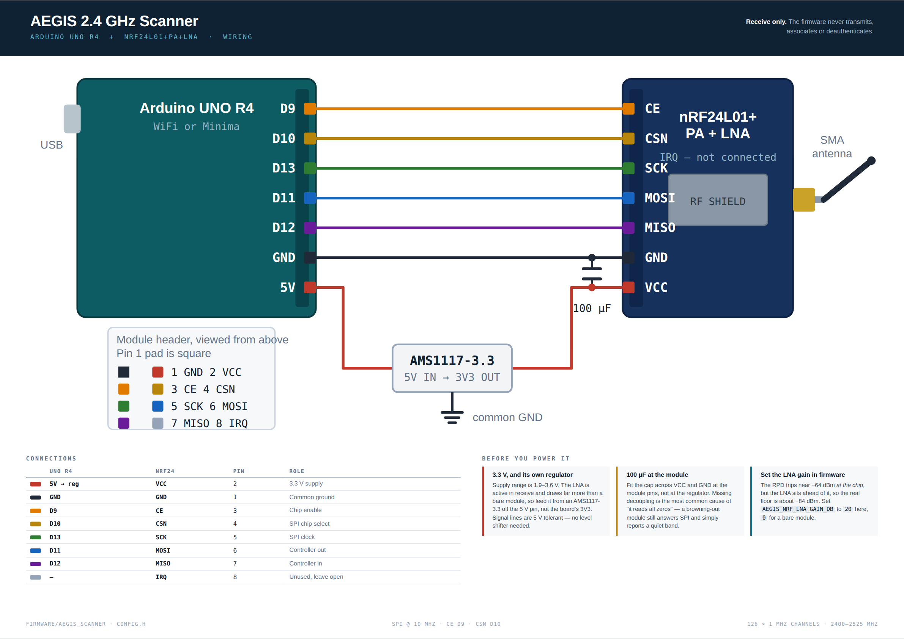

# AEGIS — Consent-Based Device Scanner

A browser-native scanner for the devices and links around you, built on standard
web platform APIs. Canvas radar plot, extruded 3D lettering, twelve pluggable
connectors, zero dependencies, zero build step.

Everything it reports comes from an API the browser gated behind a permission
prompt and a user gesture. Nothing is persisted and nothing is transmitted — no
storage, no analytics, no network calls of any kind.

## Running it

Two ways, and the difference matters:

```bash
npm install && npm start   # desktop shell — everything, including real WiFi scanning
python3 serve.py           # browser — everything except WiFi (http://localhost:8000)
```

The browser build is the whole app minus one connector. The desktop shell is the
same page in an Electron window with a narrow native bridge attached, which is
the only way to get genuine WiFi scanning (see below).

Any static server works for the browser build (`npx serve`, `php -S`, …), but
you do need one: opening `index.html` over `file://` fails, because ES modules
are blocked by CORS and every device API requires a secure context.
`http://localhost` counts as secure; anything else needs real HTTPS.

Chromium-family browsers expose the most connectors. Firefox and Safari have
deliberately not shipped WebUSB, WebHID, Web Serial or Web Bluetooth — the app
detects this and marks those connectors unavailable rather than failing at the
prompt.

## About WiFi scanning

**No web page in any browser can enumerate nearby WiFi networks.** The
[Network Information API](https://wicg.github.io/netinfo/) is the only spec that
describes the connection at all, and its entire surface is `type`,
`effectiveType`, `downlink`, `downlinkMax`, `rtt` and `saveData` — no SSID, no
BSSID, no access point list, no scan method. Network identity is treated as
sensitive under [W3C fingerprinting guidance](https://www.w3.org/TR/fingerprinting-guidance/),
and SSIDs in particular leak [names, locations and occasionally passwords](https://link.springer.com/chapter/10.1007/978-3-031-09234-3_19).
A web app that shows you a list of nearby networks is fabricating it.

Three near-misses, none of which change the answer for a web page:

- **`chrome.networking.onc`** does real scanning — `requestNetworkScan()`,
  plus `SSID`, `BSSID`, `SignalStrength` and `Security` per network. It is
  ChromeOS-only, restricted to extensions and auto-launched kiosk sessions, and
  part of the Chrome Apps platform deprecated in 2020. Unreachable from a page.
- **Firefox OS `WifiManager.getNetworks()`** did the same for certified apps.
  That platform is archived.
- **[Neighbour Awareness Networking](https://discourse.wicg.io/t/proposal-neighbour-awareness-networking-js-api/3478/)**
  (Wi-Fi Aware) is an early WICG *draft proposal* for peer-to-peer device
  discovery — not access point scanning. Not shipped in any browser.

So the honest framing is that WiFi scanning was never specified for the web
rather than formally rejected: it is deliberately outside what the netinfo spec
chose to expose, and no vendor has shipped an equivalent.

What the platform *does* expose is the properties of the link this device is
already on, which is what the **Network Link** connector reports: bearer type
(wifi / ethernet / cellular), effective class, downlink estimate, RTT, and every
transition between them. Real data, honestly labelled.

For an actual airspace survey you need adapter access, which means leaving the
browser. There are two ways out, and they answer different questions:

- **WiFi Scan** delegates to the host OS through the desktop shell. Tells you
  what *this machine's* adapter sees.
- **Arduino 2.4 GHz Scanner** reads a stacked UNO R4 over Web Serial. Its own
  radios report the band directly — and since Web Serial is a browser API, this
  path needs no native shell at all. The plain browser build gets real RF
  scanning after all.

## Hardware scanning: the UNO R4

`firmware/aegis_scanner/` turns a stacked Arduino UNO R4 into a 2.4 GHz scanner
that streams newline-delimited JSON over USB. Three sources:

| Source | Hardware | What it sees |
| --- | --- | --- |
| WiFi AP scan | ESP32-S3 (R4 WiFi) | SSID, BSSID, RSSI, channel, encryption |
| BLE advertisements | ESP32-S3 (R4 WiFi) | Address, local name, RSSI |
| Raw band sweep | stacked nRF24L01+ | Occupancy of all 126 × 1 MHz channels |

The third one is why this is worth building. The nRF24 sees *everything*
radiating in the band, including devices that never announce themselves —
Zigbee, wireless peripherals, video senders, a leaky microwave. It is a carrier
detector rather than a receiver, so it reports occupancy above roughly -64 dBm
rather than true power, and the app labels it as such.

Receive only: the firmware never transmits, associates, or deauthenticates.

Enabling it reveals a **2.4 GHz Spectrum** panel — occupancy bars with
peak-hold over a scrolling waterfall, WiFi channels 1/6/11 marked behind them,
plus board status and live source controls. The waterfall is what makes a
hopping emitter legible: a device that changes channel every sweep draws a
diagonal trail no single-frame view would show.

If your module is a **+PA+LNA** type (SMA connector, screw-on antenna), set
`AEGIS_NRF_LNA_GAIN_DB` to match. Its amplifier sits ahead of the chip, so the
real detection floor is roughly `-64 dBm − LNA gain` — about -84 dBm rather than
-64. The firmware reports the resulting floor and the panel displays it, so the
figure on screen always describes your hardware. These modules also want a
separate 3.3 V supply.

Both board variants build from the same sketch — the Minima has no radio, so its
build omits the WiFi and BLE sources automatically.



Pin-for-pin wiring, the 3.3 V and decoupling gotchas, the serial protocol and the
tuning knobs are all in [`firmware/README.md`](firmware/README.md). The diagram
above is generated from [`docs/wiring-diagram.html`](docs/wiring-diagram.html) —
A3 landscape, printable.

## The desktop shell

`npm start` runs the same page in an Electron window with a deliberately narrow
bridge attached at `window.aegisNative`. There is no generic
`invoke(channel, …)` escape hatch: the renderer gets `wifi.scan()`,
`wifi.backend()` and the device-picker calls, and nothing else. Node is fully
isolated from the page (`contextIsolation: true`, `sandbox: true`,
`nodeIntegration: false`).

The page is served from a custom `aegis://` scheme rather than `file://`.
That is not cosmetic — `file://` blocks ES modules under CORS *and* is not a
secure context, which would silently disable Web Bluetooth, WebUSB, WebHID and
Web Serial. Registering the scheme as `standard` + `secure` restores both
without touching `webSecurity`.

### Per-platform backends

| OS | Command | Caveats |
| --- | --- | --- |
| Linux | `nmcli -t -f IN-USE,SSID,BSSID,SIGNAL,CHAN,FREQ,SECURITY dev wifi list` | Needs NetworkManager running. A `rescan` is attempted first and ignored if rate-limited. |
| macOS | `system_profiler SPAirPortDataType -json` | `airport -s` was gutted in 14.4 and now only prints a deprecation notice. Location Services permission is required for SSIDs, and **BSSIDs are not exposed at all** — the field stays null rather than being invented. |
| Windows | `netsh wlan show networks mode=bssid` | Since the fall 2024 release, BSSID-bearing APIs return `ERROR_ACCESS_DENIED` without precise-location consent, with a one-time system prompt. |

Failures come back as structured codes (`NO_TOOL`, `SERVICE_DOWN`,
`PERMISSION_DENIED`, `NO_ADAPTER`, …) carrying a hint, so the UI can tell you
*how* to fix it instead of showing an empty list. Each BSSID becomes its own
contact, so a multi-radio AP appears once per radio and you can watch the 2.4
and 5 GHz signals move independently.

### Device choosers

Electron ships no chooser UI for Bluetooth/USB/HID/Serial — without a handler
those requests hang. `js/picker.js` draws one, fed by all four
`select-*-device` events. The consent model is unchanged: the page still sees
exactly one device that you picked by hand, and cancelling produces the same
`NotFoundError` a browser chooser would. In a plain browser the module is inert
and the browser's own picker is used.

### Parser tests

```bash
npm test
```

The three output parsers are pure functions with no `child_process` import, so
they are tested against captured fixtures on any machine — including CI runners
with no wireless adapter. 14 tests cover the nmcli escaped-colon problem
(BSSIDs contain colons, which terse mode escapes as `\:` — splitting naively
shreds every MAC), multi-BSSID netsh blocks, hidden SSIDs, CRLF, the 6 GHz
band, permission-denied output, and cross-parser record-shape agreement.

## Connectors

| Connector | API | What it reports |
| --- | --- | --- |
| Arduino 2.4 GHz Scanner | Web Serial → UNO R4 | Access points, BLE advertisements and raw band occupancy, straight off the radio |
| WiFi Scan | host OS via desktop shell | Nearby access points: SSID, BSSID, signal, channel, band, security, PHY mode |
| Bluetooth LE Scan | `requestLEScan` | Nearby advertisements: name, RSSI, TX power, service UUIDs, manufacturer data |
| Bluetooth Device Pair | `requestDevice` + GATT | Manufacturer, model, firmware, serial, battery of a device you pick |
| Network Link | Network Information | Bearer, effective class, downlink, RTT, online transitions |
| Local Interfaces | WebRTC host candidates | This machine's interface count and mDNS-masked addresses |
| USB Devices | WebUSB | VID/PID, class codes, USB version, serial, configuration count |
| HID Devices | WebHID | Usage page/ID, report collection counts, open state |
| Serial Ports | Web Serial | Granted ports and their USB IDs — listed, never opened |
| Media Devices | `enumerateDevices` | Cameras, microphones, speakers (labels withheld until granted) |
| Geolocation | Geolocation | Lat/lon, accuracy radius, altitude, heading, speed |
| Power Source | Battery Status | Charge level, charging state, time to full/empty |
| Motion Sensors | DeviceMotion/Orientation | Accelerometer, gyroscope, orientation frame |
| Host Profile | ambient properties | CPU threads, memory class, display, GPU, locale — no prompt needed |

Bluetooth LE Scan is the one connector that needs more than a permission grant:
it is Chromium-only and sits behind
`chrome://flags/#enable-experimental-web-platform-features`. The app shows a
`FLAG NEEDED` badge when that is the case rather than silently doing nothing.

**Host Profile** is included to make a point. It reads a dozen identifying
properties with no prompt whatsoever, because that is what every page you visit
can already do.

## Layout

```
index.html              markup and panel structure
styles.css              theme, glass panels, responsive grid
serve.py                dev server (localhost = secure context)
js/
  app.js                orchestration, UI rendering, export
  text3d.js             extruded 3D text renderer
  radar.js              canvas PPI radar
  store.js              in-memory contact store
  spectrum.js           2.4 GHz occupancy bars + waterfall
  picker.js             device chooser overlay (desktop shell only)
  connectors/
    base.js             Connector contract and lifecycle helpers
    arduino.js          UNO R4 2.4 GHz scanner over Web Serial
    wifi.js             native WiFi scan via the desktop bridge
    bluetooth.js        LE advertisement scan, GATT device pairing
    network.js          link telemetry, local interface enumeration
    wired.js            USB, HID, Serial, media devices
    environment.js      geolocation, battery, motion, host profile
native/
  main.js               Electron main: custom scheme, IPC, device choosers
  preload.cjs           the narrow bridge exposed to the page
  scanner/
    index.js            platform dispatch, command execution, error codes
    parsers.js          pure nmcli / netsh / system_profiler parsers
    parsers.test.js     fixture-driven tests, no adapter required
firmware/
  aegis_scanner/
    aegis_scanner.ino   UNO R4 sketch: WiFi + BLE + raw band sweep
    nrf24.h             minimal nRF24L01+ carrier-detect driver
    config.h            board detection, wiring, tuning
  README.md             stacking, wiring, flashing, serial protocol
```

### The 3D text

`text3d.js` renders extruded lettering on a plain 2D canvas — no WebGL, no
libraries. Depth comes from stacking ~24 offset copies of the glyphs along a
light-aware extrusion vector with per-slice shading, topped with a gradient
face, a clipped specular sweep and a chromatic edge fringe. Yaw and pitch follow
the pointer through a critically-damped spring, so the letters read as a solid
object rather than a parallax gimmick.

### The radar

Bearing is a deterministic FNV-1a hash of the contact id, so a device keeps its
slot on the scope across re-renders. Range maps signal to distance — strong
signal plots near the centre. A contact only lights up as the sweep line crosses
its bearing and then decays, which is how a real PPI display behaves. Non-RSSI
sources (GPS accuracy, battery level, link quality) are mapped onto the same
dBm-style scale so everything shares one visual language.

## Adding a connector

Extend `Connector`, declare the static metadata, and register the class in
`js/connectors/index.js`:

```js
import { Connector } from './base.js';

export class MyConnector extends Connector {
  static id = 'mine';
  static name = 'My Connector';
  static icon = '🛰️';
  static kind = 'env';          // ble | net | usb | env — sets the radar colour
  static description = 'What it reads and what it needs.';
  static action = 'Enable';

  support() {
    return 'mySensor' in navigator
      ? { level: 'ok', note: 'ready' }
      : { level: 'no', note: 'unsupported here' };
  }

  async start() {
    // listen() and every() auto-unbind in stop()
    this.every(1000, () => this.emit({
      id: `${MyConnector.id}:thing`,
      name: 'Thing',
      identifier: 'abc',
      signal: -55,              // dBm-ish, or null
      detail: 'free-form text',
    }));
    this.active = true;
  }
}
```

`emit()` upserts by id, so repeat sightings update a row in place and extend its
signal history instead of piling up duplicates. Throwing from `start()` is the
correct way to report a denied permission — `app.js` translates the DOMException
into plain language and leaves the connector off.

## Export

**Export JSON** downloads the current contact list with first/last-seen
timestamps, hit counts, the set of active connectors and the user agent. The
file is generated from an in-memory blob and never uploaded.

## Scope and lawful use

This tool observes only what your own device is authorised to see. It does not
capture packets, intercept traffic, deanonymise anyone, or touch hardware you
have not personally granted it. Those limits are the browser's, not a policy
choice made here — which is precisely why a consent-based scanner is worth
building on the web platform.
